# WebApplication for Event Registration

## AIM:
To create a UX design and develop a web application for event registration.
## DESIGN STEPS:
## DESIGN SCREENS:
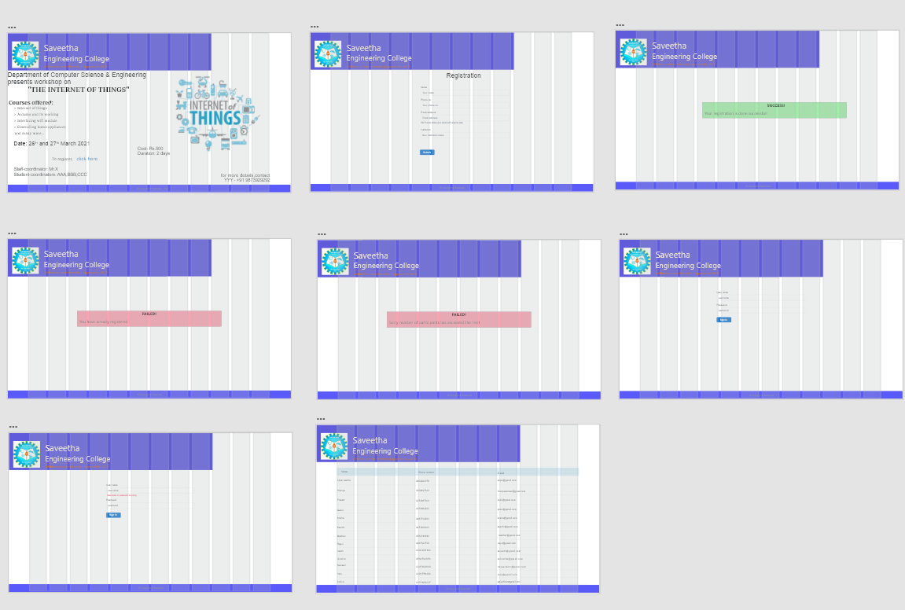

## WIREFRAME:
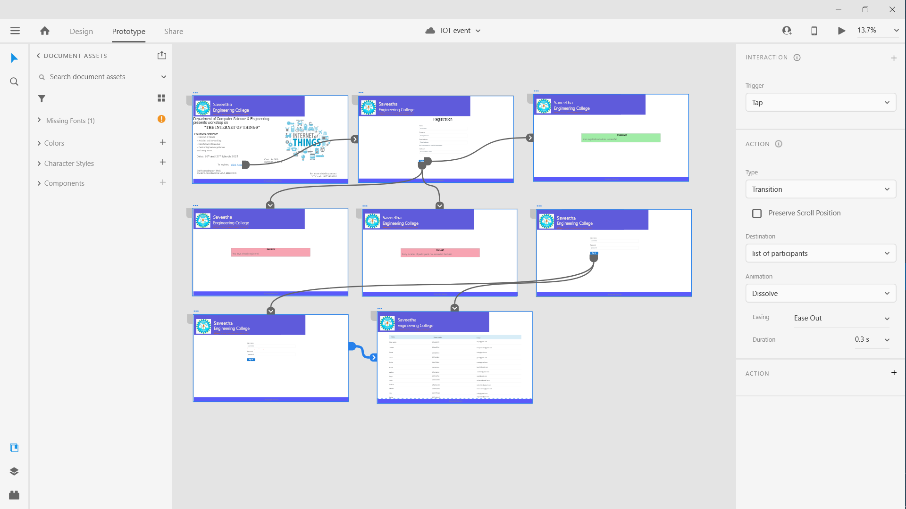

## PRoTOTYPE:
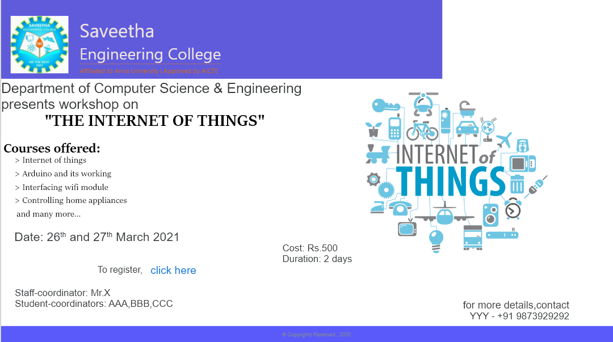
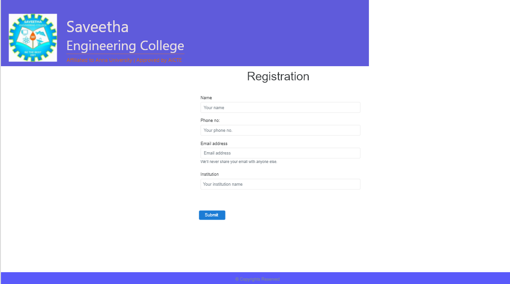
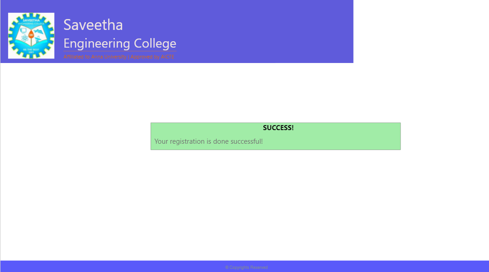
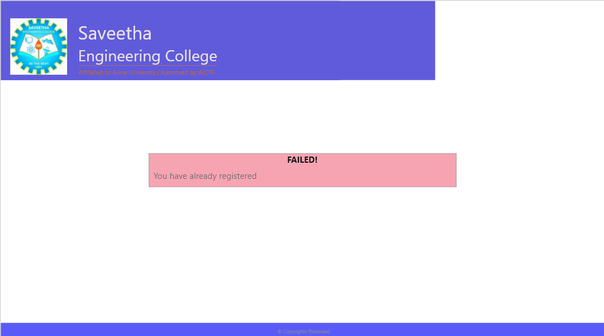
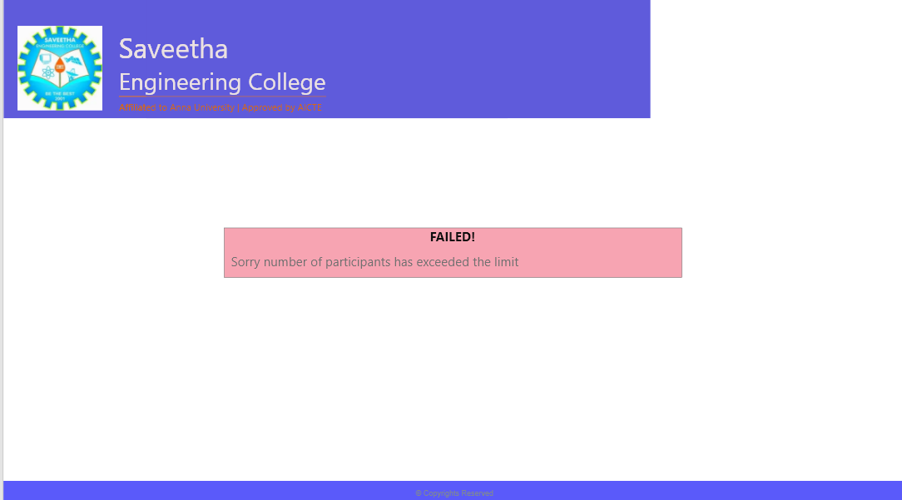
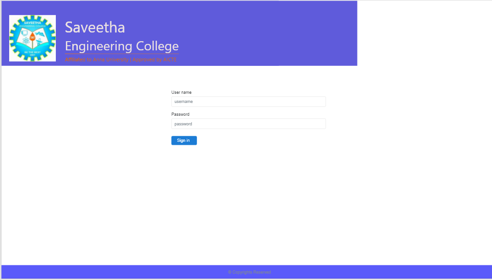
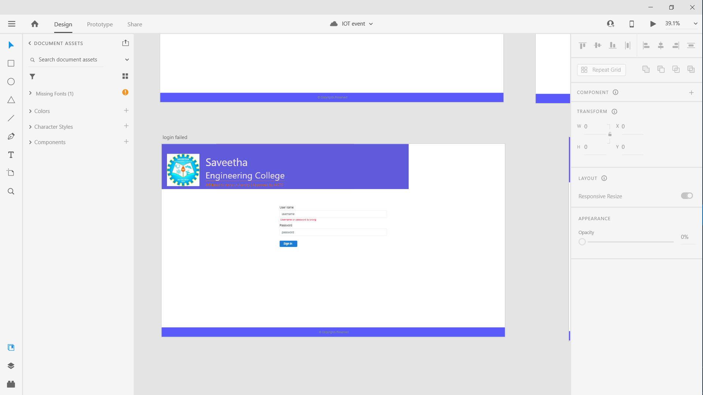
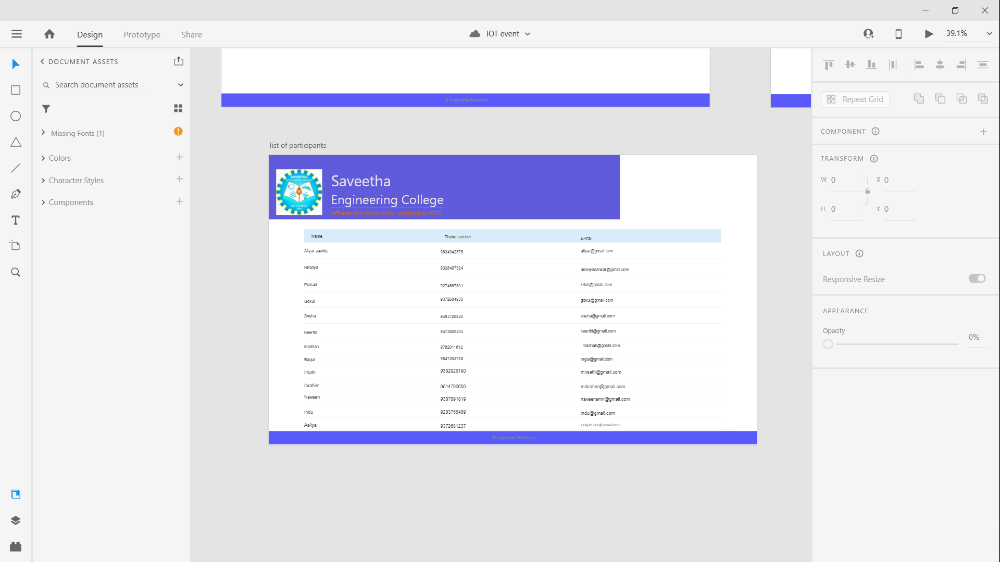

## PROGRAM:
### base.html:
```

<!doctype html>
<html lang="en">
  <head>
    <!-- Required meta tags -->
    <meta charset="utf-8">
    <meta name="viewport" content="width=device-width, initial-scale=1, shrink-to-fit=no">

    <!-- Bootstrap CSS -->
    <link rel="stylesheet" href="https://maxcdn.bootstrapcdn.com/bootstrap/4.0.0/css/bootstrap.min.css" integrity="sha384-Gn5384xqQ1aoWXA+058RXPxPg6fy4IWvTNh0E263XmFcJlSAwiGgFAW/dAiS6JXm" crossorigin="anonymous">

    <title> IOT Event </title>
  </head>
  <body>
    <div class="jumbotron pl-3 pb-3 pt-3 col-sm-12 col-md-9" style="background-color:#5A5AFA;color:white;">
        <div class="container">
            <div class="media">
                
                <div class="media-body">
                    <h2 class="mt-0 display-5">Saveetha</h2>
                    <h2 class="mt-0 display-5">Engineering College</h2>
                    <p class="col-sm-12 col-md-5 border-top border-warning" style="color:#DC680E;">
                        Affilated to Anna University|Approved by AICTE
                    </p>
                </div>
            </div>
        </div>
    </div>
        
    
    <div class="container col-12 text-center" style="background-color:#5A5AFA;">
        © Copyrights Reserved , 2020
    </div>


    <!-- Optional JavaScript -->
    <!-- jQuery first, then Popper.js, then Bootstrap JS -->
    <script src="https://code.jquery.com/jquery-3.2.1.slim.min.js" integrity="sha384-KJ3o2DKtIkvYIK3UENzmM7KCkRr/rE9/Qpg6aAZGJwFDMVNA/GpGFF93hXpG5KkN" crossorigin="anonymous"></script>
    <script src="https://cdnjs.cloudflare.com/ajax/libs/popper.js/1.12.9/umd/popper.min.js" integrity="sha384-ApNbgh9B+Y1QKtv3Rn7W3mgPxhU9K/ScQsAP7hUibX39j7fakFPskvXusvfa0b4Q" crossorigin="anonymous"></script>
    <script src="https://maxcdn.bootstrapcdn.com/bootstrap/4.0.0/js/bootstrap.min.js" integrity="sha384-JZR6Spejh4U02d8jOt6vLEHfe/JQGiRRSQQxSfFWpi1MquVdAyjUar5+76PVCmYl" crossorigin="anonymous"></script>
  </body>
</html>
```

### home.html:
```



    <div class="row" style="max-width:100% !important;overflow: hidden !important;">
        <div class="container col-xs-12 col-md-7">
           <h3 class="text-justify">Department of Computer Science & Engineering presents you workshop event,</h3>
           <h2 class="text-center">"THE INTERNET OF THINGS"</h2>
           <h4 class="font-weight-bold text-justify mt-4">Courses offered:</h4>
           <h5 class="text-justify mt-2 pl-3">> Intro of internet of things</h5>
           <h5 class="text-justify pl-3">> Arduino and it's working</h5>
           <h5 class="text-justify pl-3">>Interfacing wifi module</h5>
           <h5 class="text-justify pl-3">>Controlling home appliances</h5>
           <h5 class="text-justify pl-3">and many more...</h5>
           <h4 class="text-justify pl-3 pt-3">Date: 26th and 27th March 2021<h4 class="text-center pt-3">To register!,<a href="registration" class="btn btn-link" role="button">Click here</a></h4></h4>
           <h5 class="text-right">Cost: Rs.500</h5>
           <h5 class="text-right">Duration: 2 days</h5>           
        </div>
        <div class="col-xs-4 col-md-5">
           
        </div>
        <div class="col-9">
            <h6 class="text-justify pl-3">Staff-container: Mr.X</h6>
            <h6 class="text-justify pl-3">Student-coordinators: AAA,BBB,CCC</h6>
        </div>
        <div class="col-xs-2 col-md-2 text-center">
            <h6>For more details,contact</h6>
            <h6>YYY - +91 9873929292</h6>
        </div>
    </div>


```

### registration.html:
```


            <div class="col-9 container">
                <h2 class="text-center">Registration</h2>    
                <form style="padding-bottom:120px;" action="/registration/" method="POST">
                    
                    <div class="form-group">
                        <label for="name">Name</label>
                        <input type="text" class="form-control col-xs-10 col-lg-5" id="name" name="name" placeholder="Enter your name">
                    </div>
                    <div class="form-group">
                        <label for="phoneno">Phone no.</label>
                        <input type="text" class="form-control col-xs-10 col-lg-5" id="phoneno" name="phoneno" placeholder="Your phone no">
                    </div>
                    <div class="form-group">
                        <label for="email">Email address</label>
                        <input type="email" class="form-control col-xs-10 col-lg-5" id="email" name="email" aria-describedby="emailHelp" placeholder="Your email id">
                        <small id="emailHelp" class="form-text text-muted">We'll never share your email with anyone else.</small>
                    </div>
                    <div class="form-group">
                        <label for="institutionname">Institution</label>
                        <input type="text" class="form-control col-xs-10 col-lg-5" id="insitutionname" name="institutionname" placeholder="Your institution name">
                    </div>
                    <button type="submit" class="btn btn-primary">Submit</button>
                </form>
            </div>

``` 

### success.html:
```


        <div class="container" style="padding-top:200px; padding-bottom:243px;">
            <div class="alert alert-success" role="alert">
                <h2 class="alert-heading text-center">SUCCESS!</h2>
                <p>Your registration is done successfully!</p>
            </div>
        </div>

```
### failure.html:
```


        <div class="container" style="padding-top:200px; padding-bottom:243px;">
            <div class="alert alert-danger" role="alert">
                <h2 class="alert-heading text-center">Failed!</h2>
                <p>Sorry number of participants has exceeded the limit!</p>
            </div>
        </div>

```

### retry.html:
```


        <div class="container" style="padding-top:200px;padding-bottom:243px;">
            <div class="alert alert-danger" role="alert">
                <h2 class="alert-heading text-center">FAILED</h2>
                <p>Your have already registered</p>
            </div>
        </div>

```

### login.html:
```
 

    <div class="container col-xs-10 col-lg-5" style="padding-bottom:330px;">
        <form action="/listofparticipants/" method="POST" class="px-4 py-3">
            
            <div class="form-group">
            <label for="username">User name</label>
            <input type="text" class="form-control col-xs-10 col-lg-8" id="username" name="password" placeholder="username">
            </div>
            <div class="form-group">
            <label for="password">Password</label>
            <input type="password" class="form-control col-xs-10 col-lg-8" id="password" name="password" placeholder="Password">
            </div>
            <button type="submit" class="btn btn-primary">Sign in</button>
        </form>
    </div>

```

### loginfailed.html:
```


    <div class="container col-5" style="padding-bottom:305px;">
        <form action="/listofparticipants/" method="POST" class="px-4 py-3">
            
            <div class="form-group">
                <label for="username">User name</label>
                <input type="text" class="form-control col-xs-10 col-lg-8" id="username" name="username" placeholder="user name">
                <small class="form-text text-danger">Username or password is wrong</small>
            </div>
            <div class="form-group">
                <label for="password">Password</label>
                <input type="password" class="form-control col-lg-8" id="password" name="password" placeholder="Password">
            </div>
            <button type="submit" class="btn btn-primary">Sign in</button>
        </form>
    </div>

```

### listofparticipants.html:
```


    <table class="table table-bordered">
        <thead class="table-primary">
            <tr>
                <th scope="col">Name</th>
                <th scope="col">Phone number</th>
                <th scope="col">E-mail id</th>
            </tr>
        </thead>
        <tbody>
            
            <tr>
                <th scope="row">{{i.name}}</th>
                <td>{{i.phoneno}}</td>
                <td>{{i.email}}</td>
            </tr>
            
        </tbody>
    </table>

```

### views.py:
```
from django.shortcuts import render
from eventregistration.settings import EMAIL_HOST_USER
from django.core.mail import send_mail
from .models import Participant

# Create your views here.

def home(request):
    context={}
    return render(request , 'internetofthings/home.html' , context)

def registration(request):
    context={}

    if request.method=='POST':
        p1=Participant()
        p1.name=request.POST.get('name','-')
        p1.phoneno=request.POST.get('phoneno','-')
        p1.email=request.POST.get('email','-')
        p1.institutionname=request.POST.get('institutionname','-')

        if len(Participant.objects.values_list('name',flat=True)) >= 15:
            return render(request,'internetofthings/failure.html',context)
        elif p1.email in Participant.objects.values_list('email',flat=True):
            return render(request,'internetofthings/retry.html',context)
        elif p1.phoneno in Participant.objects.values_list('phoneno',flat=True):        
            return render(request,'internetofthings/retry.html',context)
        else:
            p1.save()
            return render(request,'internetofthings/success.html',context)
    
    if request.method=='GET':
        context['name']=""
        context['phoneno']=""
        context['email']=""
        context['institutionname']=""
    return render(request , 'internetofthings/registration.html' , context)

def listofparticipants(request):
    context={}
    if request.method=='POST':
        username=request.POST.get('username','-')
        password=request.POST.get('password','-')
        if username=='dk20004660' and password=='u63676':
            participants=Participant.objects.all()
            context["participants"]=participants
            return render(request , 'internetofthings/listofparticipants.html' , context)
        else:
            return render(request,'internetofthings/loginfailed.html',context)
    if request.method=='GET':
        context['username']=""
        context['paasword']=""
    return render(request,'internetofthings/login.html',context)
```
## OUTPUT:
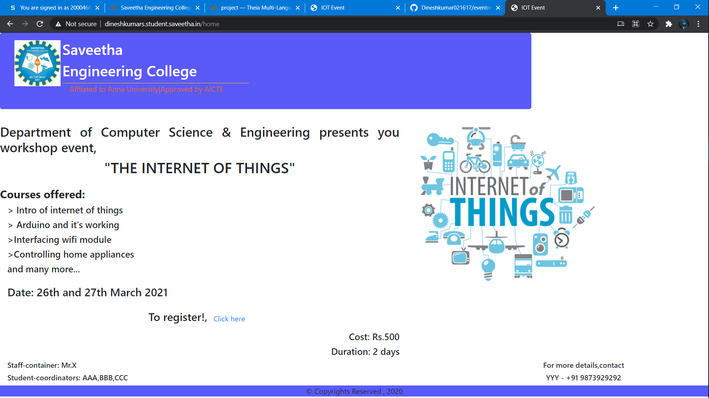
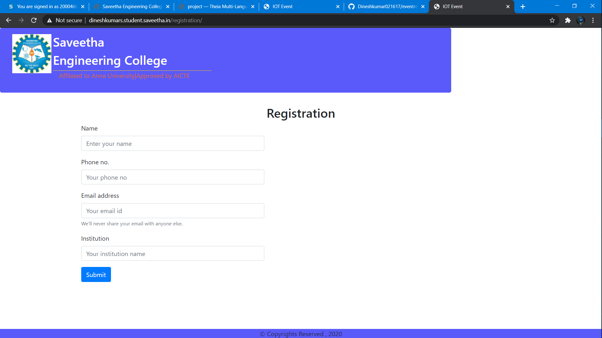
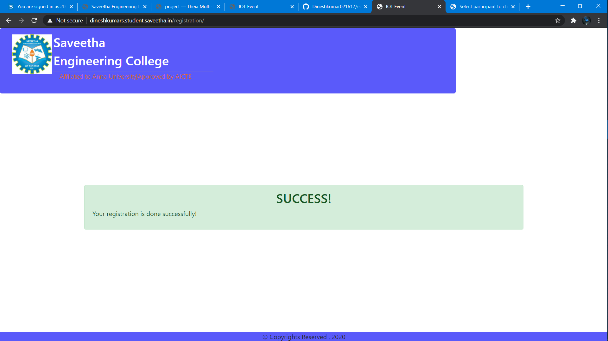
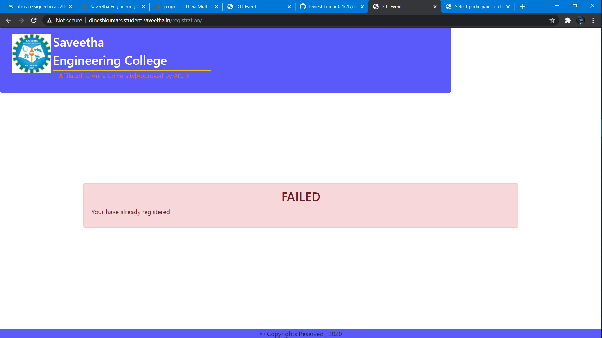
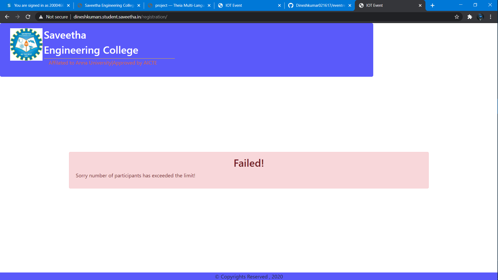
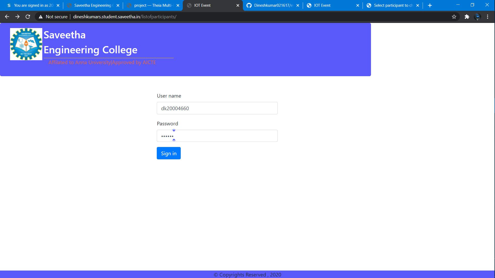
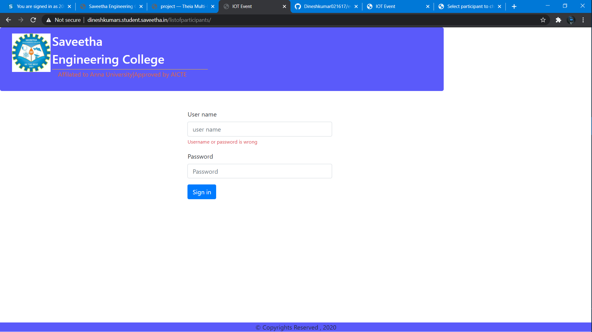
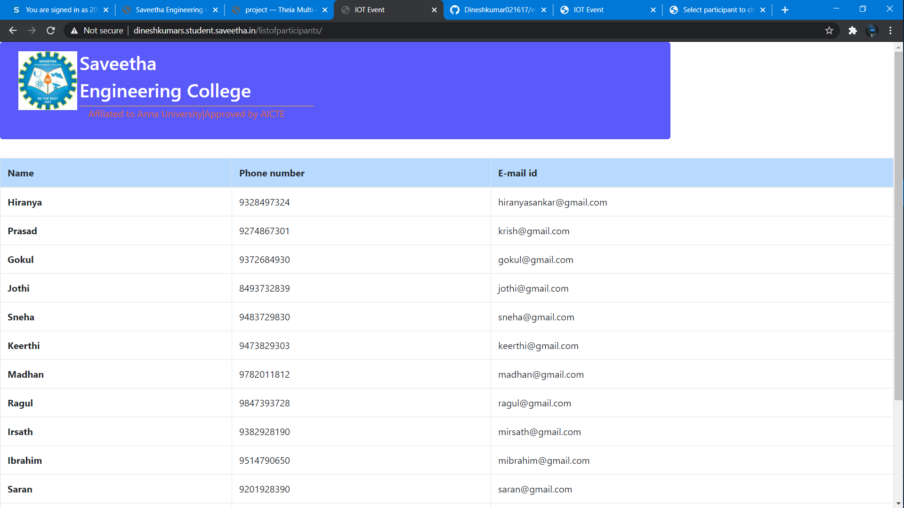

## RESULT:
Thus a website is created to register for a event and and show the participants list and is hosted on website url http://dineshkumars.student.saveetha.in/home  and http://dineshkumars.student.saveetha.in/listofparticipants/